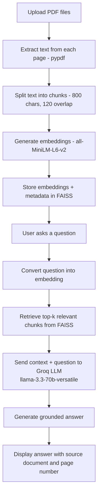

# Architecture & Workflow

## System Workflow

## Component Overview

| Layer | Module | Responsibility |
|---|---|---|
| UI | `app.py` | File upload, Process Documents trigger, chat interface, source display, Clear Chat |
| Ingestion | `document_loader.py` | Extracts text per page with `pypdf`, attaches `{source, page}` metadata, chunks with `RecursiveCharacterTextSplitter` |
| Indexing | `vector_store.py` | Embeds chunks with FastEmbed (`all-MiniLM-L6-v2`), builds/saves/loads a FAISS index |
| Retrieval + Generation | `rag_pipeline.py` | Embeds the query, retrieves top-k chunks, builds context, calls Groq LLM, returns answer + deduplicated sources |
| Guardrail | `prompt.py` | Prompt template that restricts the model to answering only from retrieved context, with a fixed fallback message |

## Data Flow Summary

1. **Ingestion (one-time per document set):** PDF → text (per page) → chunks (with source/page metadata) → embeddings → FAISS index (persisted to `vector_store/saved_index`).
2. **Query time:** question → embedding → FAISS similarity search (top-k) → context assembly → LLM call → grounded answer + source citations → rendered in the Streamlit chat UI.

## Why This Design

- **Chunk size (800) / overlap (120):** keeps chunks small enough for precise retrieval while overlap prevents ideas from being split across chunk boundaries.
- **FAISS:** lightweight, in-memory/on-disk vector search — no external database service needed, suitable for a single-user or small-team deployment.
- **Grounded prompt + explicit refusal message:** reduces hallucination risk and makes it clear to the user when information genuinely isn't available in the uploaded documents.
- **Source metadata (document + page):** lets the user verify any answer against the original document, which matters for policy/legal/course-material use cases.
